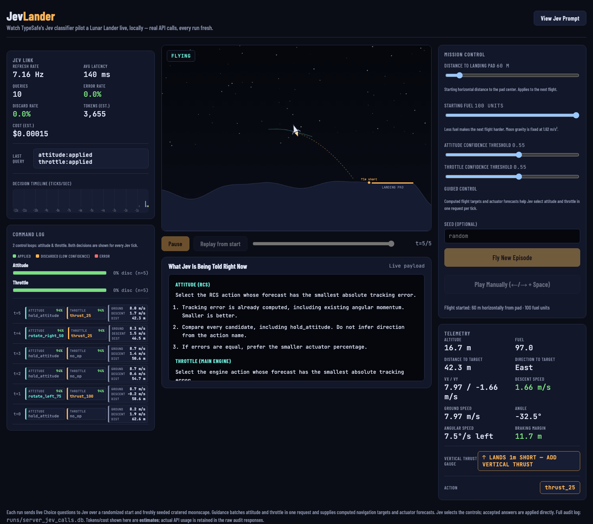
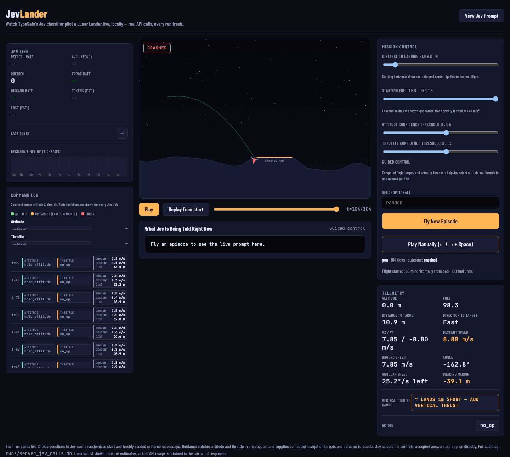

# JevGame

JevGame is a research toy in which TypeSafe's Jev classifier pilots a Lunar
Lander through typed Choice questions. It includes deterministic physics, a
local web interface, manual play, replay, SQLite audit logs, and a reproducible
benchmark runner.

## Screenshots

The live console shows the flight stage, Jev request health, both control loops,
mission settings, and the current forecast criteria.



Completed flights can be scrubbed and inspected after the fact. The replay view
keeps the exact prompt criteria and audit summary beside the recorded state.



## Run it locally

```sh
python3 -m venv .venv
.venv/bin/python -m pip install -e '.[dev]'
.venv/bin/python -m pytest -q
.venv/bin/python -m jevgame.server
```

Open <http://127.0.0.1:8971>. The server uses Moon gravity at 1.62 m/s² and
keeps the physics, terrain, fuel use, and landing thresholds fixed. Mission
distance and starting fuel apply to the next Jev or manual flight; replay speed
is independent of difficulty.

API access is optional for the physics-only demo and manual mode. Live guided
runs require an access token, supplied explicitly as either a plain-text file
or an environment-variable name. The two sources are mutually exclusive and
the token is never stored in this repository.

## How the controller works

The current controller is guidance-assisted. Code computes navigation targets
and one-tick forecasts for every actuator choice. Jev selects attitude and
throttle independently in one batched request, and accepted answers are applied
directly. The controller does not claim that Jev is planning a flight unaided,
or that it improves on the deterministic forecast selector.

Each tick offers nine attitude choices (`hold_attitude` plus four strength
levels in each direction) and five throttle choices (`no_op` plus 25%, 50%, 75%,
and 100%). The two selected controls are combined and applied concurrently.
Separate confidence thresholds gate the two answers. Missing keys, failed
requests, malformed answers, invalid choices, and low-confidence answers use
the safe fallback for that control. Every result is logged with the full
question payload, raw response, threshold, outcome, and state before and after.

The manual mode uses the same physics and terrain. Arrow keys control attitude;
Space controls the main engine.

## CLI

Run the physics-only demo without making API calls:

```sh
.venv/bin/python -m jevgame.cli watch --render
```

Run live Jev episodes and write one SQLite audit database:

```sh
.venv/bin/python -m jevgame.cli run \
  --episodes 10 --seed 1000 --db runs/jev_calls.db \
  --token-env API_TOKEN
```

Replace `API_TOKEN` with the name of the environment variable that holds
your token. A file can be used instead:

```sh
.venv/bin/python -m jevgame.cli run \
  --episodes 10 --db runs/jev_calls.db \
  --token-file ~/.config/jevgame/token
```

Run a reproducible holdout benchmark. The output directory must not already
exist; the runner records starting states, source hashes, model versions, raw
requests and responses, per-episode results, and a 95% Wilson interval.

```sh
.venv/bin/python -m jevgame.cli benchmark \
  --episodes 60 --seed-start 1000 --output runs/my-holdout \
  --token-env API_TOKEN
```

The web server accepts the same options:

```sh
.venv/bin/python -m jevgame.server --token-env API_TOKEN
```

Use `--token-env NAME` for an environment-variable name or `--token-file PATH`
for a file containing only the token. If neither is supplied, guided requests
fall back safely and record an API failure while the local simulation remains
usable.

Use `--attitude-threshold` and `--throttle-threshold` for independent gates,
and `--min-distance` and `--max-distance` to match a benchmark to the UI's
approach range. A seed reproduces the initial world; a remote model's answers
need not be deterministic.

## Audit data

The `jev_calls` table stores one row per control question. It includes the
episode and tick, full request and response JSON, confidence, threshold,
applied composite action, state snapshots, and the outcome. Human-play commands
are stored in the same database with `step = 'human'` so manual and Jev runs
can be compared without changing the physics.

Benchmark directories also contain `manifest.json`, `episodes.jsonl`,
`summary.json`, `summary.md`, and one SQLite database per episode. Existing
directories are refused rather than overwritten.

## Research result

The evaluation report in [docs/jev-research.md](docs/jev-research.md) records
the payload design, experiments, measured results, and limitations. The tested
100-flight holdout landed successfully, but the deterministic selector landed
the same starts too. That result supports Jev as a reliable consumer of narrow,
prepared actuator choices; it does not show that Jev independently solves
navigation or adds control value.

## Project shape

- `jevgame/physics.py` — deterministic Lunar Lander physics with no Jev dependency.
- `jevgame/guidance.py` — navigation targets and actuator forecasts.
- `jevgame/jev_player.py` — API boundary, validation, confidence gates, and safe fallbacks.
- `jevgame/episode.py` — shared tick loop for CLI runs and live SSE streaming.
- `jevgame/audit.py` — durable SQLite audit logging.
- `jevgame/server.py` and `jevgame/web/index.html` — local web game, manual controls, and replay.
- `tests/` — physics, controller, server, benchmark, and web-script checks.

The project stays standalone: it does not connect to an external daemon or
database, train Jev, or expose open-ended actions.
